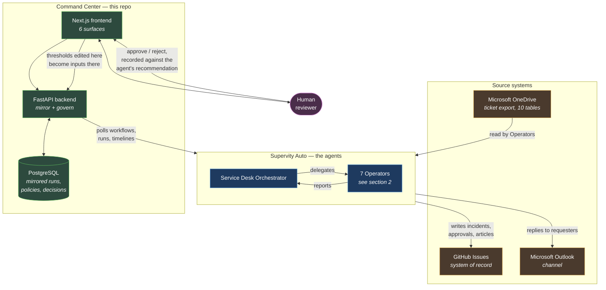
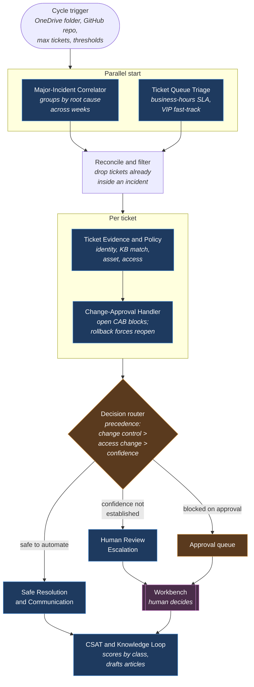
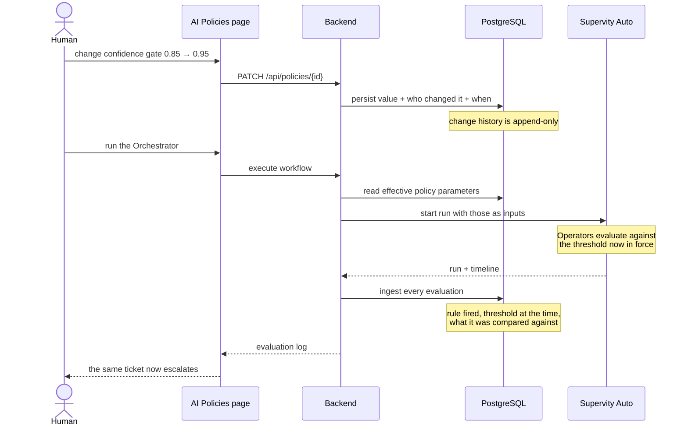
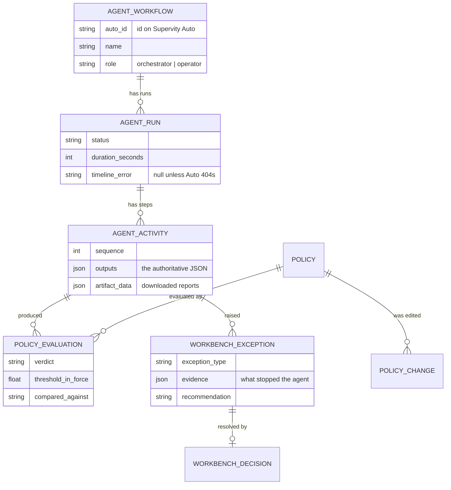

# Architecture

Service Desk Command Center · Autopilot Asia 2026 Round 2 · Track 3

The organising rule, and the one that shapes every diagram below: **Supervity
Auto decides and acts; this repo displays and governs.** No clustering, no
classification, no policy verdict is computed here. The Command Center reads
what the Operators emitted, ranks it, and shows which run produced it.

---

## 1 · The whole system

**Why the arrow from the Command Center to Auto is one-way for decisions.** The
backend reads run history; it never posts a verdict back. The only influence it
has is through *policy parameters* — a threshold edited in the UI becomes an
input on the Orchestrator's next run. That keeps the audit trail single-sourced:
if a decision exists, an Operator made it.

---

## 2 · The agent cycle

One Orchestrator delegating to seven Operators. Correlation and triage start
together; the run then branches three ways on the decision.

**Four independent reasons the agent stops**, in precedence order — an open
change request outranks everything, then an access or entitlement change, then
unresolved requester identity, then confidence below the gate. None can be
overridden by urgency: a Highest-priority breached ticket was held back because
two employees share a display name.

---

## 3 · How a policy change reaches the agent

The demo moment: edit a threshold, and the next run behaves differently. No
code, no workflow rebuild.

Every evaluation is stored with the threshold that applied *at that moment*, so
a later edit never rewrites history.

---

## 4 · Where the data lives

Runs deleted on Auto are pruned here rather than lingering, so the Operator
count on screen is always what actually exists.

---

## 5 · Integrations

Eight, discovered from the workflows on Auto rather than declared in config —
connect something new there and it appears in the Data Manager.

| Category | Integration | Health basis |
|---|---|---|
| Agent Platform | Supervity Auto | direct probe |
| Data Source | Microsoft OneDrive | inferred from agent runs |
| System of Record | GitHub Issues | inferred from agent runs |
| Communication | Microsoft Outlook | inferred from agent runs |
| Database | PostgreSQL | direct probe |
| Human-in-the-loop | Human Input Form | inferred from agent runs |
| Storage | Output Artifacts | inferred from agent runs |
| AI | Language Model | inferred from agent runs |

The Data Manager labels which is which. OneDrive, GitHub and Outlook are reached
by the Operators using their own credentials, so this backend has nothing to
probe — claiming a live check it cannot make would be a lie, and a degraded
badge here means runs using that integration actually failed.

---

## 6 · Design decisions worth defending

**Nothing is invented.** If a value cannot be traced to a source row or an agent
run, it is not displayed. MTTR is blank with the reason printed beside it: no
Operator reports resolution timestamps, and the Command Center does not compute
metrics the agents have not produced. A dash is honest; a zero is a claim.

**Deflection is two numbers, never blended.** Tickets already collapsed into a
single incident are avoided work. Tickets targeted by a proposed permanent fix
are a forecast, conditional on a human approving it. Adding them together would
produce a better headline and a worse answer.

**The AI Manager holds no model.** Answers are assembled from mirrored agent
output and cite the Operator they came from; a question outside that data gets
"I can't answer that from agent data" rather than a plausible guess. Round 1
caught Supervity's own chat summaries inventing ticket numbers while its audit
log said otherwise — this surface cannot repeat that failure.

**AI Insights re-presents, it does not analyse.** The clustering that recognised
the same payroll complaint in four languages happened inside the Correlator on
Auto. This page ranks those findings and names the run that produced each.

**Nothing is hardcoded to the sample data.** No ticket key, person, article id
or expected count appears anywhere in the repo. Field-name aliases are mapped,
because the agent generates its own key names — but no value is.
